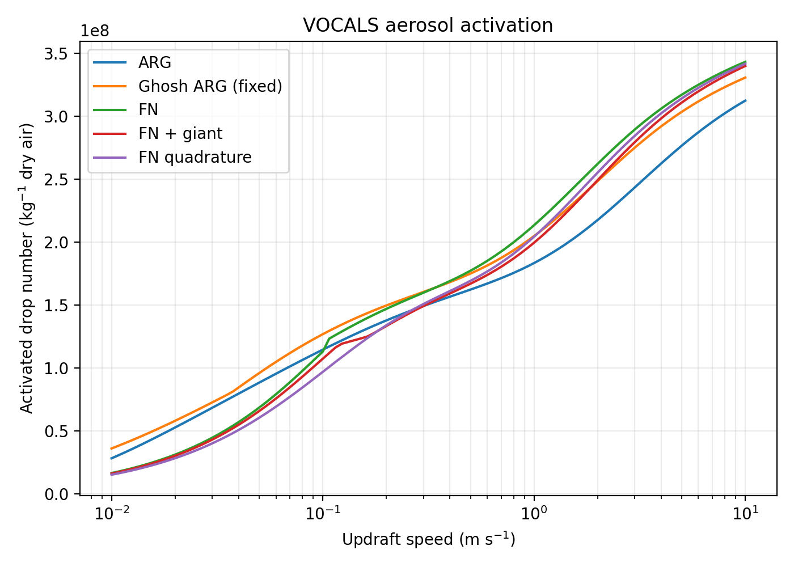
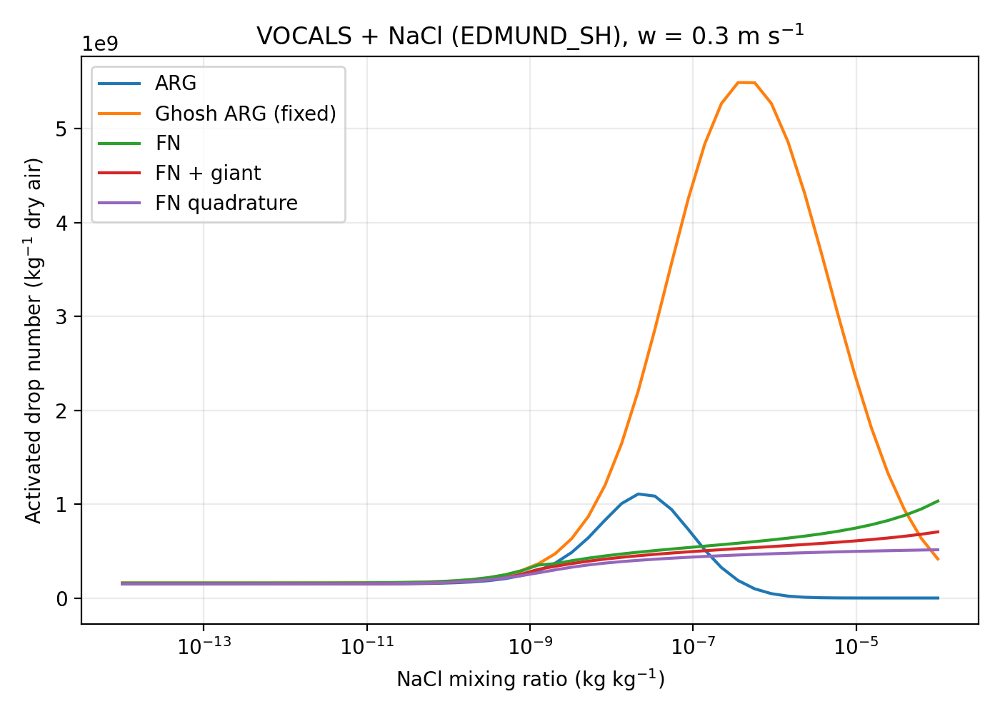

# Bulk Aerosol Module (BAM)

BAM is a Fortran bulk aerosol activation module for calculating warm-cloud droplet activation from one or more lognormal aerosol modes. It includes:

- Abdul-Razzak and Ghan (ARG) activation for multiple externally mixed modes.
- Ghosh et al. (2025) modified ARG, including its polluted-regime kinetic correction.
- Fountoukis and Nenes (FN) activation.
- The optional giant-CCN correction used with FN.
- An FN variant that evaluates the growth integral by quadrature.
- Optional equilibrium co-condensation of semi-volatile organics following the approach of Connolly et al. (2014).

The public BAM interface uses **mixing-ratio units per kg of dry air** for aerosol and droplet number. The activation and equilibrium-partitioning equations are converted internally to their required volumetric basis.

## Build

Requirements:

- `gfortran`
- `make`
- Python 3 with `numpy` and `matplotlib` for the sweep script

Build the executable with:

```bash
make
```

The embedded OSNF numerical library is built automatically. BAM only requests `osnf_lib.a`; the OSNF example executable and its NetCDF dependency are not required.

A runtime-checking build is available with:

```bash
make debug
```

This enables bounds checking, floating-point traps, backtraces, and compiler warnings.

Clean with:

```bash
make clean
```

or clean BAM and OSNF together with:

```bash
make cleanall
```

## Run

```bash
./main.exe namelist.in
```

The deterministic output contains the updraft speed, activated fraction of each mode, total activated droplet number in `kg-1 dry air`, and the total activated fraction.

## Public units

The unit convention at the BAM interface is:

| Quantity | Units / definition |
|---|---|
| `n_aer1` | particles `kg-1 dry air` |
| output droplet number | drops `kg-1 dry air` |
| `d_aer1` | dry median diameter, m |
| `sig_aer1` | `ln(sigma_g)`; it is **not** `sigma_g` |
| `molw_core1`, `molw_org1` | kg mol-1 |
| `density_core1`, `density_org1` | kg m-3 |
| `nu_core1`, `nu_org1` | van 't Hoff/effective solute factor |
| `org_content1` | microgram `kg-1 dry air` in each volatility bin |
| `log_c_star1` | `log10(C* / (microgram m-3))` at 298.15 K |
| `p_test` | Pa |
| `t_test` | K |
| `w_test` | m s-1 |

### Internal conversion of number concentration

ARG and FN are formulated using aerosol number per unit volume. BAM therefore converts the public number mixing ratio internally using the dry-air density at the assumed cloud-base RH:

```text
N_vol = N_kg * rho_dry
rho_dry = (p - RH * e_sat(T)) / (R_d * T)
```

with `RH = 0.999` in the current cloud-base setup.

Activated fractions are dimensionless. The caller should therefore calculate droplet number on the public basis as:

```text
N_drop [kg-1] = sum(act_frac1 * n_aer1)
```

No density conversion is required in the caller.

## Activation schemes

`method_flag` selects the activation method:

| `method_flag` | Method |
|---:|---|
| `1` | Abdul-Razzak and Ghan |
| `2` | Fountoukis and Nenes approximate integral |
| `3` | Fountoukis and Nenes quadrature integral |
| `4` | Ghosh et al. (2025) modified ARG |

For FN, `giant_flag = 1` enables the giant-CCN correction. `giant_flag` is ignored by ARG and Ghosh ARG.

### Ghosh-modified ARG

Ghosh et al. (2025) retain the ARG supersaturation framework but replace the fitted
`f`, `g`, and (in the kinetically limited regime) `p` parameters with

```text
f = 0.0135 exp(2.367 sigma_acc)
g = 1.1058 - 0.315 sigma_acc

p = -0.5073 + 1.5088 sigma_acc - 0.3699 sigma_acc^2
    when zeta / eta_i > 1

p = 1.5
    when zeta / eta_i <= 1
```

Here `sigma_acc` is the **geometric standard deviation** `sigma_g`, not
`ln(sigma_g)`. The same `f`, `g`, and applicable `p` are used for every aerosol
mode. Ghosh et al. calibrated these functions for approximately
`1.4 <= sigma_acc <= 2.1`.

BAM provides two ways to supply that single reference width:

```text
ghosh_sigma_mode = 0
```

is the default, published-style option. BAM uses the explicitly supplied

```text
ghosh_sigma_acc
```

for all modes. For the VOCALS 154 nm mode used by the sweep script,

```text
ghosh_sigma_acc = exp(0.465) = 1.592...
```

This remains fixed when an MCB/NaCl PSD is appended, avoiding any arbitrary
choice of which injected mode should be called the accumulation mode.

The optional

```text
ghosh_sigma_mode = 1
```

is an **experimental BAM extension**, not part of the published Ghosh
parameterization. BAM diagnoses one effective `sigma_g` from the combined
current aerosol PSD between

```text
ghosh_dmin
ghosh_dmax
```

(default `80 nm` to `1 micrometre`). It analytically integrates the zeroth,
first, and second moments of `ln(D)` for every lognormal mode over that interval,
combines the modes by number, and evaluates

```text
sigma_eff = exp(sqrt(var(ln D))).
```

Thus background and injected MCB aerosol both contribute according to the
fraction of their distributions inside the accumulation-size interval. If
semi-volatiles are enabled, this diagnosis is made after the BAM
semi-volatile size adjustment, so the current PSD is used.

Because the effective-width option can diagnose values outside the
`1.4-2.1` calibration range, such cases should be treated as sensitivity
experiments rather than as the published Ghosh scheme.

The supplied namelist currently uses:

```text
a_eq_7 = 0.21
b_eq_7 = 1.58
```

These are BAM configuration parameters in the original ARG fitting function. They are ignored by `method_flag = 4`, where the Ghosh expressions above set `f`, `g`, and `p`. The source comments retain the alternative ARG coefficient sets for comparison; record the chosen values when comparing experiments.

## Semi-volatile organics

Set:

```text
sv_flag = 1
```

to enable the equilibrium semi-volatile treatment. `sv_flag = 0` bypasses all semi-volatile calculations.

The external organic loading is supplied as `org_content1` in microgram per kg dry air. Internally BAM uses a volumetric, molar partitioning calculation:

```text
org_content1 [microgram kg-1]
    -> kg m-3 using rho_dry
    -> mol m-3 using molw_org1

C* [microgram m-3]
    -> temperature-adjusted kg m-3
    -> mol m-3 using molw_org1
```

This puts `C*`, the organic concentration, and the involatile core concentration on the same molar basis in the equilibrium partition coefficient.

Condensed organic material alters aerosol mass, density, median diameter, logarithmic width, and the mixed-solute Köhler `B` parameter before ARG/FN activation is calculated.

### Current semi-volatile limitation

The current multiple-mode implementation retains the older approximation of distributing total condensed organic mass between aerosol modes **in proportion to mode number**. This is useful for retaining the original BAM/Connolly-style behaviour, but it is not the full multi-mode equilibrium/dynamic treatment developed by Crooks and co-workers. Treat multi-mode semi-volatile results accordingly.

The current equilibrium treatment also assumes equilibrium close to cloud base (`RH = 0.999`). Connolly et al. (2014) discuss conditions, particularly high updraft and low aerosol number, where equilibrium may not be reached dynamically.

## VOCALS and NaCl sweep

The repository includes:

```text
python/bam_vocals_nacl_sweeps_native_perkg.py
```

Run it from the repository root after compiling BAM:

```bash
python3 python/bam_vocals_nacl_sweeps_native_perkg.py
```

The script assumes:

```text
./main.exe
./python/bam_vocals_nacl_sweeps_native_perkg.py
```

and writes generated namelists, CSV files, and figures to:

```text
/tmp/$USER/bam_sweep_output/
```

It performs two experiments with semi-volatiles disabled:

1. VOCALS aerosol with 100 logarithmically spaced updrafts from `0.01` to `10 m s-1`.
2. VOCALS aerosol plus a selectable NaCl spray PSD at `w = 0.3 m s-1`, with NaCl mass mixing ratio varied from `1e-14` to `1e-4 kg kg-1` in 50 logarithmic steps.

The compared schemes are ARG, Ghosh ARG, FN, FN + giant CCN, and FN quadrature.

The salt PSD is selected near the top of the Python script, for example:

```python
spray_method = POWERCLOUD
```

Available definitions are `COOPER`, `HARRISON_EFFERVESCENCE`, `HARRISON_DELAVAL`, `EDMUND_SH`, `RAYLEIGH`, `TAYLOR_CONE`, `TOPAZ`, and `POWERCLOUD`.

The Python settings

```python
GHOSH_SIGMA_MODE = 0
GHOSH_SIGMA_ACC = np.exp(0.465)
GHOSH_DMIN = 80e-9
GHOSH_DMAX = 1e-6
```

control the Ghosh line in both sweeps. Set `GHOSH_SIGMA_MODE = 1` to test the
experimental effective-width response as the added MCB/NaCl distribution
changes.

The default fixed-width run retains the existing output basenames. Effective-
width runs add `_ghosh_effective` before any `_sv` suffix, so fixed and
experimental sweeps do not overwrite one another.

### VOCALS figures

The README expects the sweep figures to be committed under `figures/` with these names:





The Python script generates files with those basenames in `/tmp/$USER/bam_sweep_output/`; copy the versions you want to retain into `figures/`.

## Important corrections in this version

The following corrections can change model results:

- The public aerosol number remains `kg-1 dry air`, but ARG/FN now use the corresponding internal `m-3` concentration required by the published supersaturation balances.
- Semi-volatile organic loading is converted from microgram `kg-1` to a consistent volumetric basis internally.
- Temperature-adjusted `C*` is converted from microgram `m-3` to mol `m-3` before use in the molar equilibrium partition calculation.
- The arithmetic standard deviation of a lognormal distribution now uses `exp(0.5*ln(sigma_g)^2)` rather than `exp(0.5*ln(sigma_g))`.
- The mixed-solute Köhler `B` calculation now sums core and condensed-organic solute mole contributions explicitly. With `sv_flag = 0` it reduces to the original pure-core expression.
- The FN critical-diameter calculation uses the newly solved local `smax`, not the previous/uninitialised `smax1` output variable.
- The semi-volatile partition iteration no longer applies `nu_org` a second time after it has already been included in the effective organic solute concentration.

Robustness/build corrections include:

- zero-number modes are skipped safely;
- `w <= 0` returns zero new cloud-base activation rather than entering singular formulae;
- `ctmm_activation` establishes its own `p`, `T`, `w`, number, and mass state and no longer depends on a previous `initialise_arrays` call;
- namelist values are validated and missing required aerosol properties fail explicitly;
- the old fixed-record-length (`RECL=80`) namelist restriction is removed;
- a missing namelist command-line argument produces a usage message;
- random non-negative updrafts are sampled from a truncated Gaussian rather than generated with `abs(normal)`, which produces a folded Gaussian when the mean is non-zero;
- the top-level build requests only the OSNF library, so NetCDF is not required to compile BAM;
- parallel `make` no longer launches competing OSNF builds.

## Regression checks used for this version

The corrected source has been exercised with bounds/FPE trapping for:

- ARG;
- Ghosh-modified ARG with fixed reference width;
- Ghosh-modified ARG with diagnosed effective width;
- FN;
- FN + giant CCN;
- FN quadrature;
- semi-volatiles on and off;
- `w = 0`;
- an individual zero-number aerosol mode;
- all aerosol numbers equal to zero;
- `find_d_and_s_crits`, which is used by coupled microphysics code;
- the complete 750-case VOCALS + NaCl Python sweep with fixed-width Ghosh;
- the complete 750-case VOCALS + NaCl Python sweep with effective-width Ghosh;
- targeted semi-volatile-on sweeps for both Ghosh width options.

## References

- Abdul-Razzak, H., Ghan, S. J., and Rivera-Carpio, C. (1998), *A parameterization of aerosol activation: 1. Single aerosol type*, J. Geophys. Res., 103(D6), 6123-6131. DOI: https://doi.org/10.1029/97JD03735
- Abdul-Razzak, H. and Ghan, S. J. (2000), *A parameterization of aerosol activation: 2. Multiple aerosol types*, J. Geophys. Res., 105(D5), 6837-6844. DOI: https://doi.org/10.1029/1999JD901161
- Ghosh, P., Evans, K. J., Grosvenor, D. P., Kang, H.-G., Mahajan, S., Xu, M., Zhang, W., and Gordon, H. (2025), *Assessing modifications to the Abdul-Razzak and Ghan aerosol activation parameterization (version ARG2000) to improve simulated aerosol-cloud radiative effects in the UK Met Office Unified Model (UM version 13.0)*, Geosci. Model Dev., 18, 4899-4913. DOI: https://doi.org/10.5194/gmd-18-4899-2025
- Fountoukis, C. and Nenes, A. (2005), *Continued development of a cloud droplet formation parameterization for global climate models*, J. Geophys. Res., 110. DOI: https://doi.org/10.1029/2004JD005591
- Connolly, P. J., Topping, D. O., Malavelle, F., and McFiggans, G. (2014), *A parameterisation for the activation of cloud drops including the effects of semi-volatile organics*, Atmos. Chem. Phys., 14, 2289-2302. DOI: https://doi.org/10.5194/acp-14-2289-2014
- Crooks, M., Connolly, P., Topping, D., and McFiggans, G. (2016), *Equilibrium absorptive partitioning theory between multiple aerosol particle modes*, Geosci. Model Dev., 9, 3617-3637. DOI: https://doi.org/10.5194/gmd-9-3617-2016
